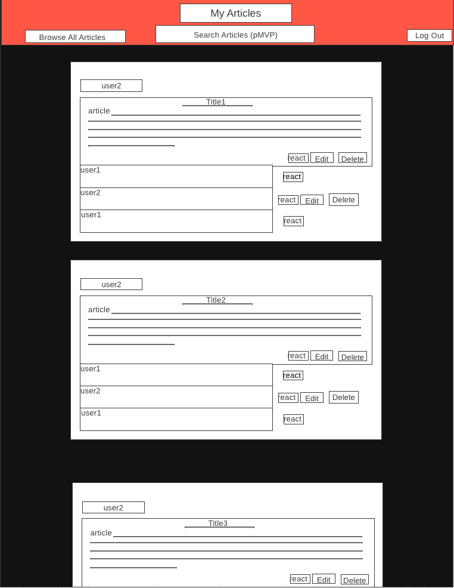
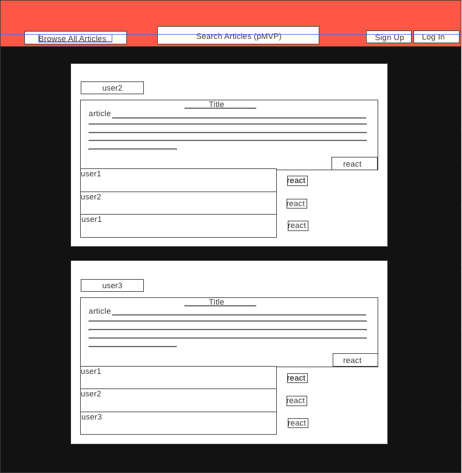
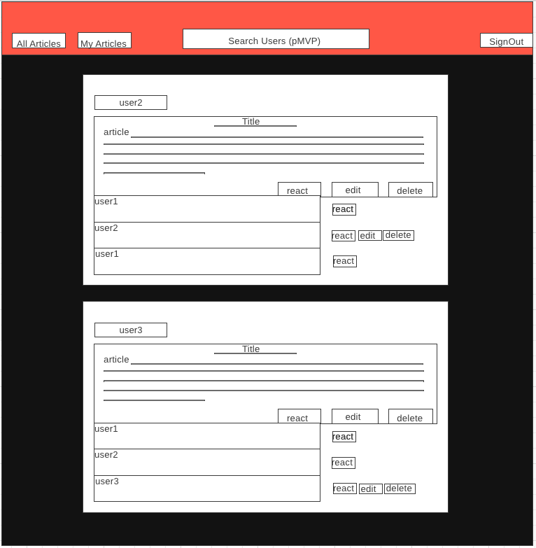
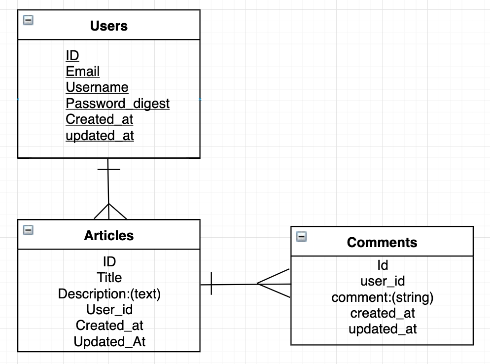

# ReadIt-Blog
A Blog application that holds CRUD operations and Authentications, designed using React as a front-end and Ruby On Rails in the back-end

# Title
ReadIt-Blog

- [Overview](#overview)
- [Features](#features)
  - [Goals](#goals)
  - [Challenges](#challenges)
  - [MVP](#mvp)
  - [Client (Front End)](#client-front-end)
    - [Wireframes](#wireframes)
    - [Component Tree](#component-tree)
    - [Component Hierarchy](#component-hierarchy)
    - [Component Breakdown](#component-breakdown)
    - [Component Estimates](#component-estimates)
  - [Server (Back End)](#server-back-end)
    - [ERD Model](#erd-model)
- [Post-MVP](#post-mvp)
- [Code Showcase](#code-showcase)
- [Code Issues & Resolutions](#code-issues--resolutions)

# Overview
This is a blog application that holds CRUD operations and Authentications, designed using React as a front-end and Ruby on Rails in the back-end. It will have a homepage that lists all created articles, and users will be able to create, edit and delete their own articles, after they have signed up or signed in.

# Features
It will be a webpage that uses React to display a homepage that holds a title, an article, and any image file associated with it. It allow user to view all articles to be viewed without having a user sign in, but once a user signs in, it will allow the user to edit or delete his own posts, while being able to view others articles as well. In the back end, Rails will determine that proper json files are created with a user having many articles, and an article belonging to a single user, and also allow authentication for a user to sign in and store password_digest locally using bcrypt. Each article will also have many comments, and those comments will belong to a single article as well.  

# Goals
- have a restful api
- users table
- articles table
- comments table
- full crud for articles and comments 

# Challenges
- Users having access to CRUD only after signing in
- Users having access to CRUD for comments on others' posts
- Using React to generate all components, and joining backend commands with front end
- Having a full understanding of authentication.

# MVP
- Having a whole system running with users, articles and comments. Allowing users to CRUD their own articles and comment on other user articles. 
- Having a restful api ready for use on React
- full authentication on both back end and front end.

# Wire-frames:
https://imgur.com/d12wKVv, https://imgur.com/OmEDAhe, https://imgur.com/bbXo8I0
 
 

 

#### Component Hierarchy
https://imgur.com/nkYvf6C

 

 

#### ERD Model

#### Component Breakdown

> Use this section to go into further depth regarding your components, including breaking down the components as stateless or stateful, and considering the passing of data between those components.

|  Component   |    Type    | state | props | Description                                                      |
| :----------: | :--------: | :---: | :---: | :--------------------------------------------------------------- |
|    Header    | functional |   n   |   n   | _The header will contain the navigation and logo._               |
|  Navigation  | functional |   n   |   n   | _The navigation will provide a link to each of the pages._       |
|    Article    | functional |   n   |   n   | _The article will show the Title and description of the item with CRUD buttons_ |
|    comments    | functional |   n   |   n   | _Each article will have it's own comments section with react button_ |
|    Footer    | functional |   n   |   n   | _The footer will show info about me and a link to my portfolio._ |

#### Component Estimates

> Use this section to estimate the time necessary to build out each of the components you've described above.

| Task                | Priority | Estimated Time | Time Invested | Actual Time |
| ------------------- | :------: | :------------: | :-----------: | :---------: |
| Add Articles Section |    H     |     5 hrs      |    hrs     |     TBD    |
| Create CRUD Actions |    H     |     7 hrs      |     hrs     |     TBD     |
| Create Comments Section |    H     |   5 hrs       |   hrs  |  TBD  |
| Create Authentication | H | 10 | hrs| TBD |
| Deployment and Bug Fixes | H | 6 | hrs| TBD |
| React Component Structure | H | 16 | hrs| TBD |
| CSS and Design  | M | 8 | hrs| TBD |
| Bug Fixes | H | 16 | hrs| TBD |
| TOTAL   |    N/A      |     82 hrs      |     hrs     |     TBD     |

# Server (Back-End)
Data architecture:
User > has_many Articles > has_many Comments
ERD model, and API endpoint documentation.

# Dependencies
A full list of all libraries, frameworks, etc.

# Post-MVP
Make a working Search Feature
Make CSS more polished
add many to many comment section

